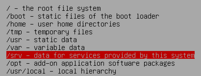
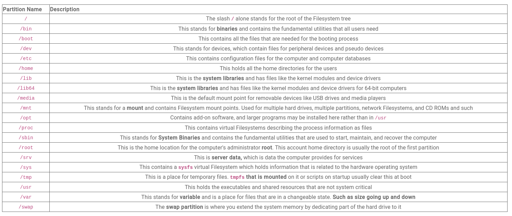
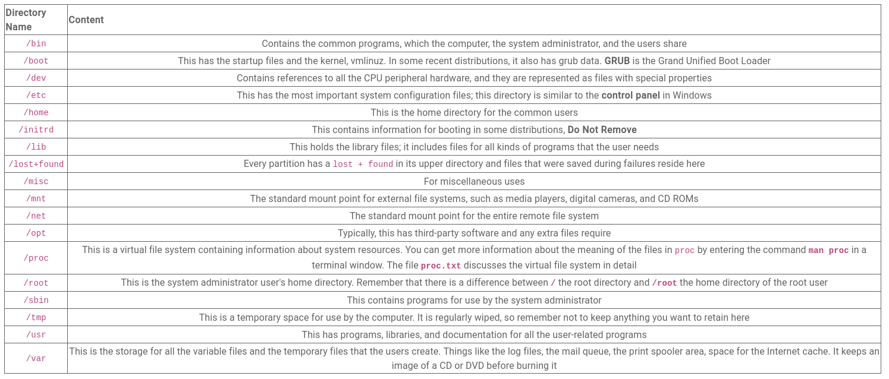

Born2beRoot Research

			[Configure the network]

Hostname: Single word that identifies your system to the network.

Domain name: Part of your Internet address to the right of your host name. If setting a home network, you can make something up, but make sure to use the same domain name on all computers.

			[Set up users and passwords]

If root user's password is left empty, the root account will be disabled and the system's initial user account will be given the power to become root using the "sudo" command.

			[Disk Partitioning]

[LVM]

From physical volumes (e.g. HDDs, SSds) create volume groups.
From volume groups create logical volumes.
Have different file systems format on the logical volumes.

https://www.youtube.com/watch?v=dMHFArkANP8
https://www.youtube.com/watch?v=214rUhQe7B4
https://www.youtube.com/watch?v=MeltFN-bXrQ

[Mount point]

A mount point, in the simplest terms, is a location in the directory structure where a separate file system gets attached. It acts as the entry point for a file system or a device, making it accessible to the user.

A mount point is a directory on a file system that is logically linked to another file system. Mount points are used to make the data on a different physical storage drive easily available in a folder structure.

https://www.idera.com/glossary/mount-points/
https://www.ibm.com/docs/en/aix/7.2?topic=mounting-mount-points
https://www.ninjaone.com/it-hub/endpoint-management/what-is-a-mount-point/
https://www.techtarget.com/whatis/definition/mount-point

[Partition]

Partitions are used to divide raw storage space into chunks (slices). This provides the means for organization and hosting of filesystems. Besides that, partitions also help isolate filesystem faults.

Three types of partitions – primary, extended, and logical.

1. Primary Partition

	A primary partition is the basic type of partition that the OS can directly use.

2. Extended Partition

	An extended partition is a special type of primary partition that acts as a container for logical partitions. It allows us to bypass the four primary partition limits imposed by MBR. Essentially, an extended partition serves as a wrapper, providing a space for logical partitions to exist.

3. Logical Partition

	Logical partitions reside within extended partitions and allow for additional storage space beyond the limit of four primary partitions. While the OS cannot directly utilize these partitions, they can be associated with a specific filesystem, such as ext4 or XFS, or any other filesystem Linux supports, to make them accessible.

https://www.baeldung.com/linux/partition-support
https://www.baeldung.com/linux/partitioning-disks

[Filesystem]

In simple terms, Directories in Ubuntu Linux are folders that contain files. There is a certain amount of overlap with the terms that are used for the partitions in the section above. The reason for this is that Linux split up the directories onto separate partitions. So that they could dedicate space to each of them and mostly to protect against data loss. 

https://www.youtube.com/watch?v=P0QZnAnsQ4c

				[VM Setup]

Add user to group:

`sudo adduser <user> <groupname>`

Check user is in group:

`nano /etc/group`

`sudo getent <groupname>`

 

[SSH]

The Secure Shell (SSH) protocol is a method for securely sending commands to a computer over an unsecured network. SSH uses cryptography to authenticate and encrypt connections between devices. SSH also allows for tunneling, or port forwarding, which is when data packets are able to cross networks that they would not otherwise be able to cross. SSH is often used for controlling servers remotely, for managing infrastructure, and for transferring files.

When traveling, the owner of a store might give their employees instructions from afar to ensure the store runs smoothly while they are gone. Similarly, SSH allows administrators to manage servers and devices from afar. Older remote management protocols like Telnet transported administrators' commands in a form that anyone could see. (Imagine if the employees put the store owner on speakerphone during a call; all the customers in the store could overhear private instructions.) Unlike Telnet, SSH is secure — hence the name Secure Shell.

https://www.cloudflare.com/learning/access-management/what-is-ssh/

[OpenSSH]

OpenSSH is the premier connectivity tool for remote login with the SSH protocol. It encrypts all traffic to eliminate eavesdropping, connection hijacking, and other attacks. In addition, OpenSSH provides a large suite of secure tunneling capabilities, several authentication methods, and sophisticated configuration options.

OpenSSH is a suite of secure networking utilities based on the Secure Shell protocol, which provides a secure channel over an unsecured network in a client–server architecture. 

https://www.openssh.com/

Edit port and PermitRootLogin policies:

`nano /etc/ssh/sshd_config`

Need to configure /etc/ssh/ssh_config as well?

Restart SSH service:

`sudo service ssh restart`

Check SSH service status:

`sudo service ssh status`

Restart SSH service:

`sudo systemctl restart ssh`

[Connecting via SSH]

Command using NAT Portforwarding (4243, Host Port, to 4242, Guest Port):

`ssh <user>@localhost -p 4242 `

[UFW]

UFW, or Uncomplicated Firewall, is an interface to iptables that is geared towards simplifying the process of configuring a firewall. While iptables is a solid and flexible tool, it can be difficult for beginners to learn how to use it to properly configure a firewall. If you’re looking to get started securing your network, and you’re not sure which tool to use, UFW may be the right choice for you.

https://www.digitalocean.com/community/tutorials/how-to-set-up-a-firewall-with-ufw-on-ubuntu

Enable UFW service:

`sudo ufw enable`

Check UFW status and numbered rules:

`sudo ufw status numbered`

Allow port on UFW:

`sudo ufw alow <port_nbr>`

[Sudo policies]

Create folder /var/log/sudo to log commands, input and output.

Create file /etc/sudoers.d/sudo_config to store sudo policy.

Sudo policy

`Defaults  passwd_tries=3`

`Defaults badpass_message="-------"`

`Defaults  logfile="/var/log/sudo/sudo_config"`  

`Defaults  log_input, log_output`  

`Defaults  iolog_dir="/var/log/sudo"`  

`Defaults  requiretty` 

`Defaults  secure_path="/usr/local/sbin:/usr/local/bin:/usr/sbin:/usr/bin:/sbin:/bin:/snap/bin"`

When requiretty is set, sudo must be run from a logged-in terminal session (a tty). This prevents sudo from being used from daemons or other detached processes like cronjobs or webserver plugins. It also means you can't run it directly from an ssh call without setting up a terminal session.

This can prevent certain kinds of escalation attacks. For example, if I have a way to modify the crontab for a user who has NOPASSWD sudo permissions, I could use that to kick off a job as root. With requiretty, I can't do that...

...easily. This restriction is not particularly hard to circumvent, and so generally isn't all that useful compared to the valid use cases it breaks. Red Hat used to use it, but removed it a few years ago.

https://stackoverflow.com/questions/67985925/why-would-i-want-to-require-a-tty-for-sudo-whats-the-security-benefit-of-requi

What is TTY (and PTY)?

[Password Policy]

Edit /etc/login.defs file.

PASS_MAX_DAYS 30  
PASS_MIN_DAYS 2  
PASS_WARN_AGE 7  

PASS_WARN_AGE: The number of days a warning is issued to the user before an impending password expiry.

Check password info on user:
`sudo chage -l <user>`

Change PASS_MAX_DAYS for default user:
`sudo chage -M <number> <user>`

Change PASS_MIN_DAYS for default user:
`sudo chage -m <number> <user>`

https://www.redhat.com/sysadmin/password-expiration-date-linux

Install a password quality checking library: pam_pwquality - PAM module to perform password quality checking.

Edit `nano /etc/pam.d/common-password`:
minlen=10
ucredit=-1
dcredit=-1
lcredit=-1
maxrepeat=3
reject_username
difok=7
enforce_for_root

...credit = if negative == minimum number of ... that must be met for a new pasword.  
maxrepeat = max amount of consecutive equal characters.  
difok = number of changes in the new password from the old.  
reject_username = check if password contains username, staiht or reverse.
enforce_for_root = apply also to root user.  

As regards to password having at least 7 characters not part of previous password not applying to root password:

enforce_for_root

The module will return error on failed check even if the user changing the password is root. This option is off by default which means that just the message about the failed check is printed but root can change the password anyway. **Note that root is not asked for an old password so the checks that compare the old and new password are not performed.**

https://manpages.debian.org/stretch/libpam-pwquality/pam_pwquality.8.en.html

What is PAM?

A pluggable authentication module (PAM) is a mechanism to integrate multiple low-level authentication schemes into a high-level application programming interface (API). PAM allows programs that rely on authentication to be written independently of the underlying authentication scheme.

https://en.wikipedia.org/wiki/Pluggable_authentication_module

[Script]

Architecture:

`uname` -  print system information

Processors (physical or virtual):

`/proc/cpuinfo`: `proc` - The  proc filesystem is a pseudo-filesystem which provides an interface to kernel data structures.

What is really a virtual processor?

RAM:

`free --mega` - Display amount of free and used memory in the system

Disk:

`df -m` - report file system disk space usage

CPU load:

`vmstat ` - vmstat reports information about processes, memory, paging, block IO, traps, disks and cpu activity.

One could put no option but if given it will output info for an interval of seconds, e.g. from 1 to 4.

https://www.baeldung.com/linux/get-cpu-usage

Last Reboot:

`who -b` -  time of last system boot

LVM:

`lsblk` - list block devices.

TCP Established connections:

`ss -ta` - -t: Display TCP sockets, -a: display both listening and non-listening (for TCP this means established connections) sockets.

Online users:

`users` - print the user names of users currently logged in to the current host

iPv4:

`hostname - I`: display  all network addresses of the host.

MAC Address:

`ip address`

Number commands executed with sudo:

`journalctl _COMM=sudo` - query the systemd journal